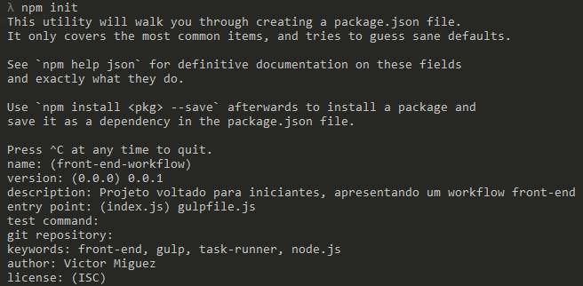

## Clonando o projeto ##

        npm install
        
        gulp watch

### TL; DR ###

	Nesse post vou ensinar a usar o Gulp.js de forma mais detalhada e didática possível, ou seja, é voltado para iniciantes.
	Mas caso você não esteja com tempo/paciência ou já conheça o Gulp, é o seguinte:
	Por favor, use um task runner! Independente de qual seja, encontre o que você gosta mais e use-o!

### Pré-requisitos ###
Para que você consiga acompanhar todo o conteúdo desse post, você precisará ter instalado:
- [Node.js](http://nodejs.org/)
- [Sass](http://sass-lang.com/)
- [Compass](http://compass-style.org/)

# Front-End Workflow #

Opa, tudo certo?

A partir de hoje vou começar uma pequena série de posts, onde vamos codar um layout, passo a passo, sem pressa.
Então precisamos arrumar nosso ambiente de trabalho, não é? Para isso explicarei o uso do [Gulp](http://gulpjs.com/). Minha intenção aqui é te explicar como funciona e como você escreve um gulpfile, então depois você precisa procurar os módulos que facilitarão sua vida. E olha, tem módulo de Gulp pra tudo que é coisa, hein... 
Os módulos que utilizaremos aqui serão:
- [gulp-compass](https://www.npmjs.org/package/gulp-compass)
- [gulp-imagemin](https://www.npmjs.org/package/gulp-imagemin)
- [gulp-changed](https://www.npmjs.org/package/gulp-changed)
- [browser-sync](https://www.npmjs.org/package/browser-sync)

## A escolha ##
Existem muitos task runners, entre eles temos o [Grunt](http://gruntjs.com/), [Brunch](http://brunch.io/), [Gulp](http://gulpjs.com/)...

"Ah, e qual o melhor?" - Não tem como eu te falar isso, é muito pessoal. O que você precisa é testá-los, e ver qual acha melhor (mas isso não quer dizer que só por isso essa ferramenta seja a melhor). Eu já testei esses três, e o que gostei mais foi o Gulp, achei a sintaxe muito mais simples e uma ferramenta fácil de ser configurada.

Mas como o assunto do post é Gulp, vamos lá.

## Instalação ##
Já tem o [Node.js](http://nodejs.org/) instalado aí? Se ainda não tem, corre lá pra instalar e volte aqui depois!

Durante a criação do nosso arquivo de configuração, nós utilizaremos muito o [npm](https://www.npmjs.org/), que é o gerenciador de dependências do Node.js.

O que precisaremos inicialmente é a própria ferramenta, então vamos abrir nosso terminal e instalá-la.

		npm install -g gulp

Com esse comando, nós estamos instalando o Gulp de forma global. É necessário que seja assim porque depois nós utilizaremos o comando "gulp" no terminal, depois na prática vai ficar mais fácil de entender ;)

Agora vamos criar uma pasta, onde teremos todos nossos futuros arquivos do projeto final.
Depois vamos até essa pasta com o terminal e utilizamos o comando

		npm init

Quando você fizer isso, aparecerá uma série de perguntas, assim:

Quando a pergunta tiver um valor entre parênteses, quer dizer que aquilo é o default dela, se você der enter direto, aquela será a resposta.

Depois de responder tudo isso, você terá que confirmar suas respostas, quando aparecer:
        
        Is this ok? (yes)

É só dar um enter e já era :D

Você pode ver que foi criado um package.json na sua pasta. Mas porque isso? É o seguinte, sempre que usarmos algo que seja feito em Node, na sua pasta você deve ter um package.json, para que o Node possa ler e saber todas as suas dependências no projeto.

Agora que temos nosso package.json criado, podemos falar para ele quais serão nossas dependências, vamos fazer por partes. Já instalamos o Gulp globalmente, mas de qualquer forma, precisamos dele também como uma dependência de desenvolvimento local, para isso use:

        npm install --save-dev gulp

Assim nós meio falamos que isso pro npm:
        
    "Ow, npm, instala esse carinha aí pra mim, mas me faz um favor? Atualiza meu package.json também?"

E esse tal de npm é bem prestativo. Se nós formos ver nosso package, ele criou isso:

    "devDependencies": {
        "gulp": "~3.8.6"
    }

Como você acabou de instalar uma dependência, será criada uma pasta chamada "node_modules", se seu projeto for versionado **nunca** versione essa pasta. Apenas mantenha seu package.json atualizado que dará tudo certo! :)

## Criando uma task simples ##

Agora que temos nosso principal dependência instalada, vamos testá-la, crie um arquivo chamado **gulpfile.js** e escreva o seguinte:

        var gulp = require('gulp');
         
        gulp.task('teste', function(){
            console.log('funcionou!');
        });

Bom, o que fizemos aqui foi, chamamos o gulp, que foi instalado na pasta "node_modules" e atribuímos uma variável para isso, apenas para facilitar o trabalho depois.
Tanto é que se você fizesse assim, também funcionaria:

        require('gulp').task('teste', function(){
            console.log('funcionou!');
        })

Depois de chamarmos o gulp, pedimos para ele criar uma tarefa chamada "teste", aqui você pode passar o nome que quiser, e então passamos o que ela deve fazer.
Você pode ir no seu terminal e digitar o comando

        gulp teste

Para chamar uma task a sintaxe é sempre essa, gulp e o nome que você atribuiu à ela.

Então verá que sua task já está funcionando! Viu como é simples?
Agora que já entendemos a estrutura de uma task no Gulp, vamos fazer algo realmente útil, hahaha.

## Compilando Sass + Compass (gulp-compass) ##

Então agora você precisa ter instalado o [Sass](http://sass-lang.com/) e o  [Compass](http://compass-style.org/)
Para isso utilizaremos o [gulp-compass](https://www.npmjs.org/package/gulp-compass). Então é aquele mesmo esquema, instalar a dependência e tal.

        npm install --save-dev gulp-compass

E depois configuramos nossa task

        var compass = require('gulp-compass');
        
        gulp.task('compass', function() {
            gulp.src('./assets/sass/*.scss')
                .pipe(compass({
                    config_file: './config.rb',
                    css: './dist/css',
                    sass: './assets/sass',
                }))
                .on('error', function(error){})
                .pipe(gulp.dest('./dist/css'));
        });

Essa é um pouco mais complexa, então vamos lá, vou te explicar o que é que está acontecendo nisso.

- *1º -* Definimos o nome da tarefa "compass";
- *2º -* "gulp.src" define onde está seu arquivo base para a tarefa, então o que definimos é que está na pasta 'assets/sass' e que essa pasta está na raiz do projeto com o './';
- *3º -* O Gulp trabalha com [pipes](http://nodejs.org/api/stream.html#stream_event_pipe) para processar os dados, então chamamos a variável "compass" e passamos as opções disponíveis do "gulp-compass";
- *4º -* Para que a dependência funcione ela precisa de "config_file" que é um config.rb que deve ser criado com as mesmas especificações que serão passadas em "css" e "sass", repare que os caminhos são exatamente os mesmos, então pode salvar esse exemplo como "config.rb":

            http_path = "/"
            css_dir = "./dist/css"
            sass_dir = "./assets/sass"
            images_dir = "./assets/img"
            javascripts_dir = "./assets/scripts"
            output_style = :compressed
            
            # output_style = :expanded or :nested or :compact or :compressed

- *5º -* ".on('error', function(error){})" que? Pra que serve isso? Então, se você não colocar essa linha, quando estiver escrevendo seu Sass, e houver algum erro, a task para e você precisa reativá-la, o que fica bem chato. Então ao usar isso, ele apenas te mostra qual erro ocorreu, você arruma e pronto, tá tudo certo já, então é bem interessante que use isso;
- *6º -* E por fim, utilizamos mais um pipe, com "gulp.dest" dizendo onde deverá ser salvo o arquivo final já compilado.

## Otimizando imagens (gulp-imagemin e gulp-changed) ##

Aqui explicarei a utilização de dois módulos muito bons, então vamos instalá-los:

        npm install --save-dev gulp-imagemin gulp-changed

É isso aí, sem virgula nem nada, quando quer instalar mais de um módulo de uma vez só é assim, só colocar o nome dele e pronto, será instalado.

        gulp.task('jpg', function() {
            gulp.src('./assets/img/**/*.jpg')
                .pipe(changed('./dist/img/'))
                .pipe(imagemin({
                    progressive: true
                }))
                .pipe(gulp.dest('./dist/img/'));
        });

- *1º -* Assim como para o compass, aqui nós também definimos onde estão nossos arquivos que devem ser processados;
- *2º -* Depois usamos o módulo "gulp-changed", é muito recomendável que você faça o uso dele. Ele compara a pasta de source com a de destino e vê qual imagem realmente deve ser otimizada, para que não se perca tempo na task otimizando uma imagem que já passou por isso;
- *3º -* Passamos como opção apenas o "progressive", porque só estamos otimizando jpg, para mais opções consulte a [documentação](https://www.npmjs.org/package/gulp-imagemin);
- *4º -* E então dizemos onde a imagem deve ser colocada depois de processada.
- **OBS:** se for utilizar o changed, você deve colocar o caminho igual ao do "gulp.dest".

## Browser Sync e Watch Task ##

Esse cara foi a forma mais fácil que eu encontrei de fazer o livereload, e além disso ele cria um localhost que fica acessível para outros dispositivos. Então vamos lá...

O browser-sync tem duas formas de ser utilizado, com ele criando um host, ou passando um proxy para o  caso de você esteja utilizando alguma linguagem back-end no projeto.
As duas formas são bastante simples, ó:

#### Host pelo Browser Sync ####

        var browserSync = require('browser-sync');
    
        gulp.task('browser-sync', function() {
            browserSync.init('./dist/css/**', {
                server: {
                    baseDir: './',
                    index: './views/index.html'
                }
            });
        });

#### Proxy pelo Browser Sync ####

        var browserSync = require('browser-sync');
    
        gulp.task('browser-sync', function() {
            browserSync.init('./dist/css/**', {
                proxy: 'localhost:3333'
            });
        });

Perceba que em qualquer um dos dois, temos o "browserSync.init" e caminhos, esses caminhos são pastas onde temos arquivos que são triggers do livereload, então quando salvarmos algum arquivo, o Browser Sync reconhece que ele foi salvo e atualiza os navegadores que estão com o localhost aberto.

No segundo exemplo, onde fazemos o proxy, você deve colocar o número da porta que já estava rodando seu projeto com sua linguagem back-end.

##### Vários locais como trigger #####

Nos exemplos acima eu passei como trigger apenas um local, que é a pasta de css, mas e se você quiser passar como trigger o css e o html? Simples, no "browserSync.init" você precisa passar esses locais como um array:

        browserSync.init(['./dist/css/**', './views/*.html'], {

### Watch Task ###

Bom, agora já configuramos nosso servidor de livereload, então para isso funcionar precisamos deixar nossos arquivos sendo observados para que tudo aconteça, isso é o mais fácil, olha aqui:

        gulp.task('watch', ['compass', 'browser-sync'], function () { 
            gulp.watch('./assets/sass/**/*.scss', ['compass']);
        });

Só isso! Perceba que na primeira linha, depois de darmos um nome para a task, abrimos um array com o nome de duas outras task, mas porque? Quando fazemos isso, garantimos que essas tarefas sejam executadas antes de começar o watch em si. Então seus arquivos Sass serão compilados e o servidor do Browser Sync ficará ativo.

Nesse caso, como é um exemplo simples, só temos uma tarefa rodando o tempo todo no watch, que é para compilar o compass, mas você pode adicionar quantas tarefas precisar.

Agora é só ir no seu terminal e digitar

        gulp watch

E pronto, seu servidor estará funcionando e você pode escrever seu Sass que já será compilado e o browser atualizando tudo sozinho :D

### Arquivo final ###

        var gulp        = require('gulp'),
            compass     = require('gulp-compass'),
            imagemin    = require('gulp-imagemin'),
            changed     = require('gulp-changed'),
            browserSync = require('browser-sync');
    
        gulp.task('compass', function() {
            gulp.src('./assets/sass/*.scss')
            .pipe(compass({
                config_file: './config.rb',
                css: './dist/css',
                sass: './assets/sass',
            }))
            .on('error', function(error){})
            .pipe(gulp.dest('./dist/css'));
        });
    
        gulp.task('jpg', function() {
            gulp.src('./assets/img/**/*.jpg')
                .pipe(changed('./dist/img/'))
                .pipe(imagemin({
                    progressive: true
                }))
                .pipe(gulp.dest('./dist/img/'));
        });
    
        gulp.task('browser-sync', function() {
            browserSync.init(['./dist/css/**', './views/**'] {
                server: {
                    baseDir: './',
                    index: './views/index.html'
                }
            });
        });
    
        gulp.task('watch', ['compass', 'browser-sync'], function () { 
            gulp.watch('./assets/sass/**/*.scss', ['compass']);
        });

### Dica ###

Aqui nos exemplos eu não defini nenhuma tarefa como "default", para que ficasse mais bem explicado, mas caso você queira, pode definir com esse nome e para executá-la só precisará rodar `gulp` no seu terminal.

## Conclusão ##

O post ficou longo, eu sei. Mas espero que você tenha conseguido entender como funciona a estrutura de um gulpfile.

Se tiver dúvidas e/ou críticas, por favor, deixe um comentário, vou ficar feliz em te responder :)